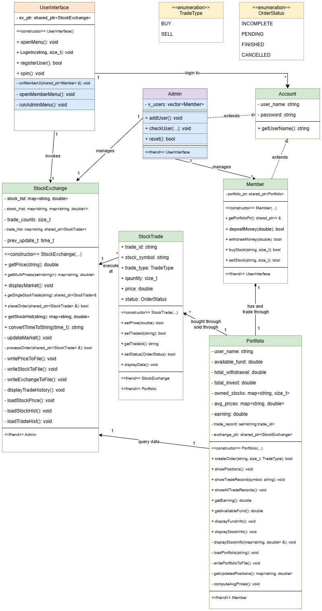

# OOP345

### This repo is for the course project of OOP345 Object-Oriented Software Development Using C++.

### Project title: **Stock Trading System**

Members:
- Bang
- Lam
- Minooei
- Tang

Creation date: 2024-Feb-10

Previous edit of ReadMe: 2024-Mar-06

----------------------------------------------------

--------------------------------------------------------

Logs:

- 2024-Feb-28: added declaration and empty implementation for: `UserInterface`, `Account`, `Member`, `StockExchange` classes
- 2024-Mar-02: added implementation for: `Account`, `Common`, `StockExchange`, `StockTrade`, `UserInterface`
- 2024-Mar-06: added first working version; [TODO]: add `Admin` class to allow stock system management